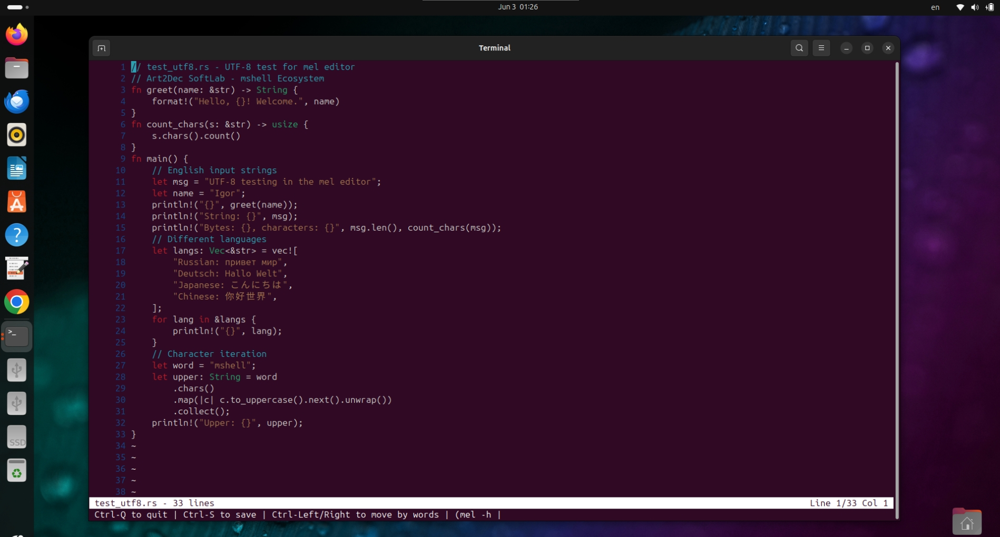
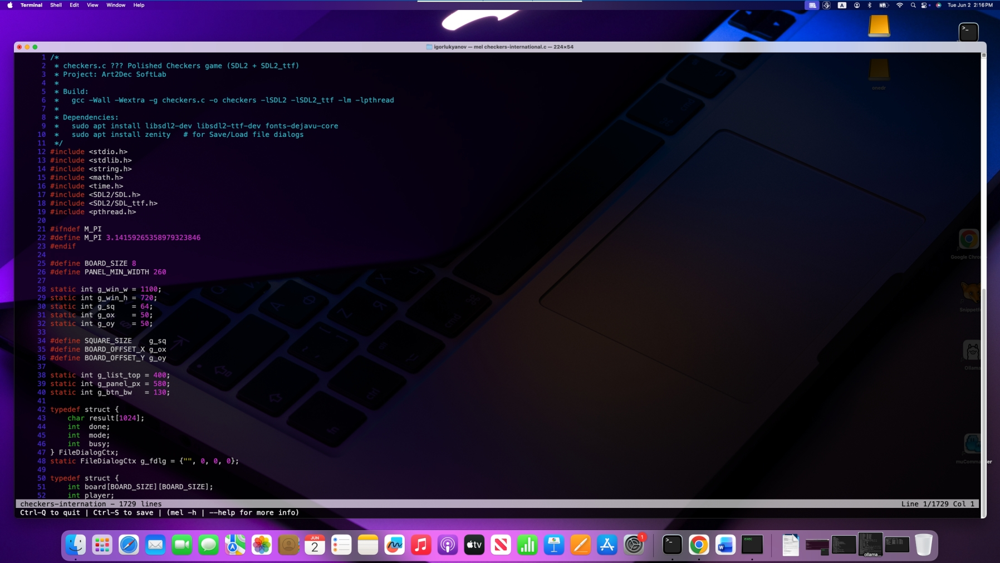
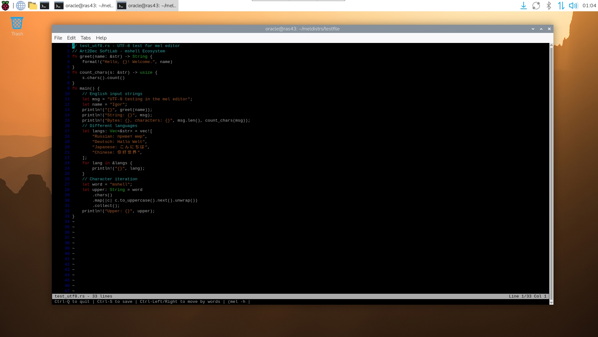
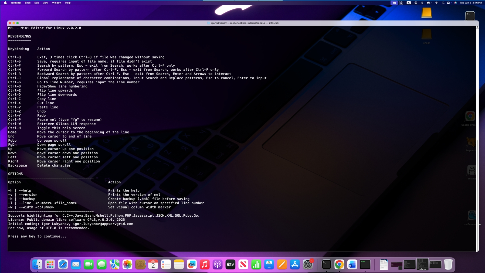
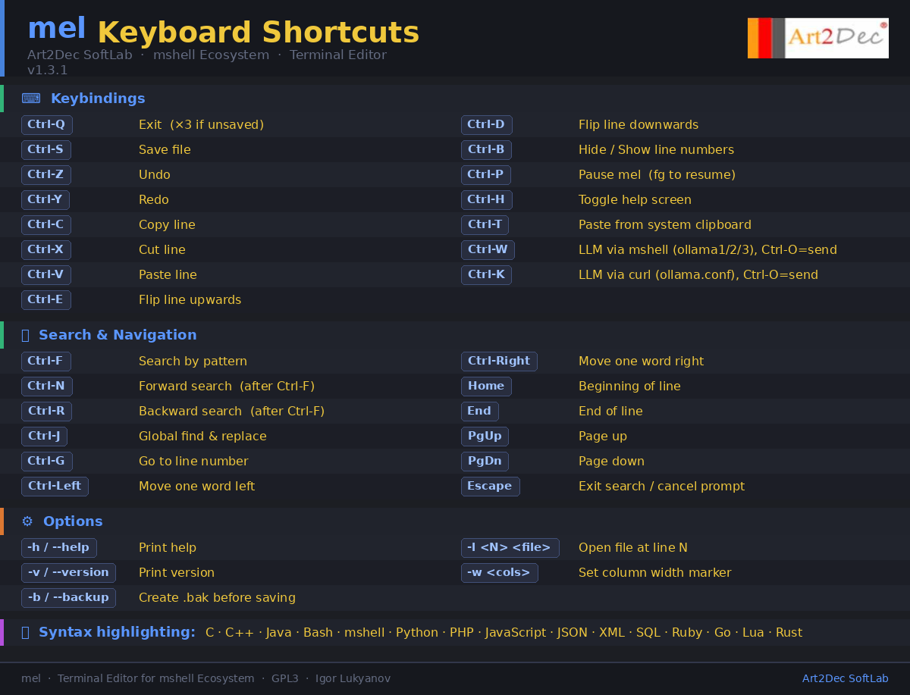

<div align="center">

# mel

### Terminal Editor · Art2Dec SoftLab · mshell Ecosystem

[](LICENSE)
[]()
[]()

**mel** (Mini Embedded Light editor) is a terminal-based text editor written in pure C from scratch.  
No curses. No ncurses. Just fast, minimal, and powerful — with native LLM integration.

</div>

---

## Screenshots

<table>
<tr>
<td align="center"><b>Ubuntu 24 LTS · x86_64</b></td>
<td align="center"><b>macOS Sequoia · Intel x86_64</b></td>
</tr>
<tr>
<td></td>
<td></td>
</tr>
<tr>
<td align="center"><b>Debian 13 · Raspberry Pi 4/5 ARM64</b></td>
<td align="center"><b>macOS · Help screen</b></td>
</tr>
<tr>
<td></td>
<td></td>
</tr>
</table>

---

## Features

- **Lightweight** — 102KB binary, no curses dependency
- **Cross-platform** — Linux x86_64, macOS Intel & Apple Silicon, Raspberry Pi ARM64
- **Full UTF-8** — Russian, Japanese, Chinese, CJK, correct cursor navigation and backspace
- **Syntax highlighting** — 15 languages: C, C++, Java, Bash, mshell, Python, PHP, JavaScript, JSON, XML, SQL, Ruby, Go, Lua, Rust
- **LLM Integration via mshell** — Ctrl-W opens full-screen prompt editor, sends to ollama1/2/3, inserts response at cursor
- **LLM Integration via curl** — Ctrl-K connects to any local or remote Ollama-compatible model via `~/.config/mel/ollama.conf`
- **System clipboard** — Ctrl-T paste from xclip/xsel/pbpaste
- **Undo/Redo** — unlimited history
- **Search & Replace** — pattern search, global replace
- **Backup** — optional `.bak` on first save

---

## Keyboard Shortcuts

<div align="center">

</div>

---

## Supported Platforms

| Platform | Architecture | Status |
|---|---|---|
| Ubuntu 22.04 / 24.04 LTS | x86_64 | ✅ Tested |
| Debian 12 / 13 | ARM64 (Raspberry Pi 4/5) | ✅ Tested |
| macOS Sequoia (Intel) | x86_64 | ✅ Tested |
| macOS Sequoia (Apple Silicon) | M1/M2/M3/M4 arm64 | ✅ Tested |
| Docker / Kubernetes Pods | x86_64 / ARM64 | ✅ Compatible |
| AWS / GCP / OCI cloud | x86_64 / ARM64 | ✅ Compatible |

---

## Installation

### Option 1 — Pre-built binaries

Download from [Releases](https://github.com/igor101964/mel/releases) or `binaries/` folder:

```bash
# Linux x86_64
sudo cp binaries/mel-ubuntu24-x86_64 /usr/local/bin/mel
sudo chmod +x /usr/local/bin/mel

# Raspberry Pi ARM64
sudo cp binaries/mel-debian13-raspberrypi4b /usr/local/bin/mel
sudo chmod +x /usr/local/bin/mel

# macOS Intel
sudo cp binaries/mel-Sequoia15-macos-x86_64 /usr/local/bin/mel
sudo chmod +x /usr/local/bin/mel
```

### Option 2 — Build from source

```bash
git clone https://github.com/igor101964/mel.git
cd mel/
bash install_deps.sh
make
make install
```

### Dependencies

```bash
bash install_deps.sh
```

Supports Ubuntu 22.04/24.04, Debian 12/13 ARM64, macOS Intel & Apple Silicon.

---

## Usage

```bash
mel myfile.py          # open file
mel                    # start empty
mel -l 42 myfile.c     # open at line 42
mel -b myfile.c        # create .bak backup on first save
mel -w 80 myfile.c     # set column width marker
mel -h | --help        # help
mel -v | --version     # version
cat file.txt | mel     # pipe content into mel
(df -m; ls -la) | mel  # pipe multiple commands
```

---

## LLM Integration

### Ctrl-W — mshell Integration (Linux)

Uses mshell built-in `ollama1`, `ollama2`, `ollama3` commands configured in `~/.mshellrc`.

1. Press **Ctrl-W** — select model (1/2/3)
2. Full-screen prompt editor opens — write your prompt in any language
3. Press **Ctrl-O** to send, **ESC** to cancel
4. Response inserted at cursor position

### Ctrl-K — curl Integration (Linux & macOS)

Connects to any Ollama-compatible REST API — local or remote.

Configure `~/.config/mel/ollama.conf`:

```ini
OLLAMA1_API_URL=http://localhost:11434/api/generate
OLLAMA1_MODEL=llama3
```

Remote model on local network:
```ini
OLLAMA1_API_URL=http://192.168.1.100:11434/api/generate
OLLAMA1_MODEL=qwen:7b
```

> **macOS**: Only Ctrl-K is available (mshell not yet on macOS)

---

## Documentation

- 📄 [User Guide PDF](docs/melEditor_User_Guide.pdf)
- 🗂️ [Cheatsheet PDF](cheatsheets/mel_cheatsheet.pdf)

---

## License

Distributed under **GNU GPL v3**. See [LICENSE](LICENSE).

---

<div align="center">

**Art2Dec SoftLab** · mshell Ecosystem · Igor Lukyanov

</div>
